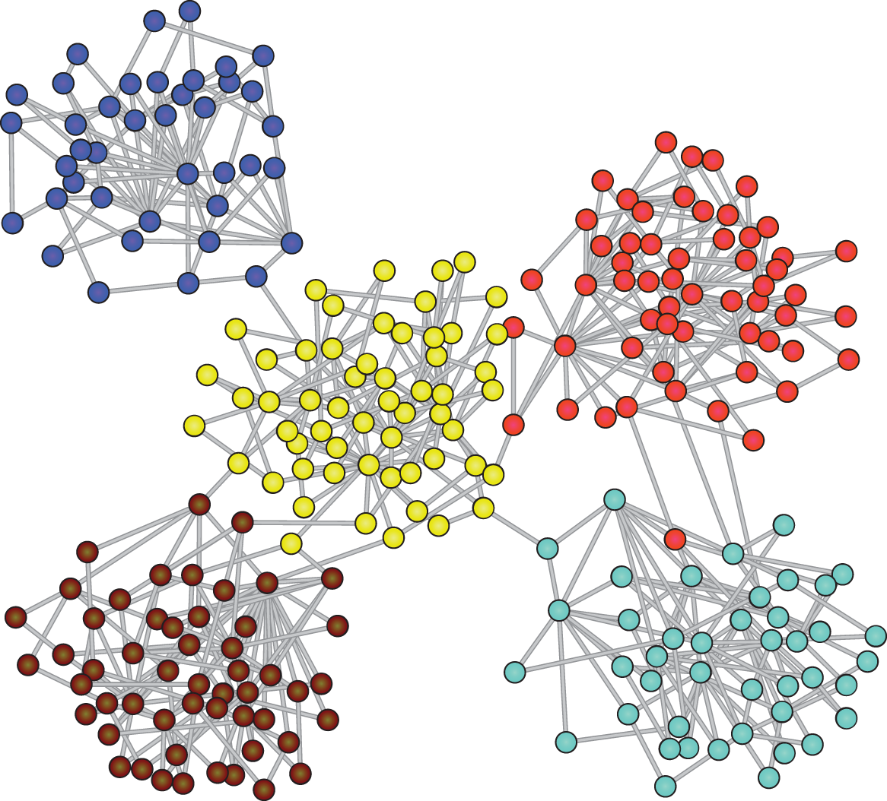

 online store customer segmentation

# <center> PROJECT-6. Кластеризация клиентов онлайн-магазина подарков </center>
## Оглавление
1. [Описание проекта](#Описание-проекта)
2. [Описание данных](#Описание-данных)
3. [Зависимости](#Зависимости)
4. [Установка проекта](#Установка-проекта)
5. [Использование проекта](#Использование-проекта)
6. [Авторы](#Авторы)


## Описание проекта

__Бизнес-задача__: определить характеристики и с их помощью спрогнозировать длительность поездки на такси.

__Техническая задача__: построить модель машинного обучения, которая на основе предложенных характеристик клиента будет предсказывать числовой признак — время поездки такси, то есть решить задачу регрессии..

Проект состоит из четырех частей:

* Первичная обработка данных
* Разведывательный анализ данных (EDA)
* Отбор и преобразование признаков
* Решение задачи регрессии: линейная регрессия и решающие деревья
* Решение задачи регрессии: ансамбли моделей и построение прогноза


**О структуре проекта:**
* [data](./data) - папка с исходными табличными данными, доступна по ссылке https://disk.yandex.ru/d/SLxuxrKa05XRjg 
* [visualization](./visualization) - папка с изображениями, необходимыми для проекта 
* [Project_5](./Project-5._Ноутбук.ipynb) - jupyter-ноутбук, содержащий основной код проекта, в котором демонстрируются методы и подходы решения задач анализа данных


## Описание данных
* [train] - обучающая выборка
* [Project5_test_data] - тестовая выборка
* [Project5_osrm_data_test] - OSRM API данные для тестовой выборки
* [osrm_data_train] - OSRM API данные для обучающей выборки
* [holiday_data] - информация о праздничных днях США
* [weather_data] - данные о погодных условиях
 

## Используемые зависимости
* Python (3.9):
    * [numpy (1.23.5)](https://numpy.org)
    * [pandas (1.4.3)](https://pandas.pydata.org)
    * [matplotlib (3.4.3)](https://matplotlib.org)
    * [seaborn (0.11.2)](https://seaborn.pydata.org)
    * [plotly.express (5.15.0)](https://plotly.com/python/plotly-express/)
    * [scikit-learn (1.3.0)](https://scikit-learn.org/stable/index.html)


## Установка проекта

```
git clone https://github.com/DSPilshchikov/sf_project_5
```

## Использование
Вся информация о работе представлена в jupyter-ноутбуке Project_5.ipynb.

## Авторы

* Дмитрий Пильщиков